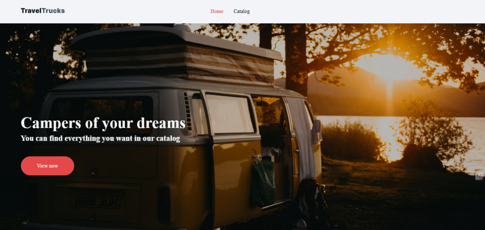

Сampers Frontend Project

Overview

The Сampers Frontend Project is a web-based platform designed for "Сampers," a camper rental company. It offers users a streamlined experience to explore, filter, and book campers efficiently. This project encompasses the following essential features:

Features

Home Page: A welcoming banner with a call-to-action button directing users to the catalog.

Catalog Page: Showcases available campers with interactive filtering based on location, body type, and amenities (e.g., air conditioning, kitchen, etc.). Users can favorite campers and dynamically load more options.

Camper Details Page: Displays comprehensive camper specifications, user reviews, a booking form, an image gallery, and a five-star rating system.

Filter and Favorites System: Enables users to refine their searches and retain a list of favorite campers even after refreshing the page.

Booking System: Users can submit booking requests with immediate confirmation feedback.

The backend API can be accessed via: MockAPI - Campers. Key endpoints include:

GET /campers: Fetches all camper listings with optional filters.

GET /campers/:id: Retrieves details for a selected camper.

Technology Stack

This project leverages modern tools and frameworks for performance, scalability, and maintainability:

Frontend Framework: React powered by Vite.

State Management: Redux for efficient global state handling.

Routing: React Router for smooth navigation.

API Handling: Axios for streamlined HTTP requests.

Styling: CSS modules for modular and maintainable styles.

Hosting & Deployment: The application is deployed on Vercel.

Installation and Setup

Follow these steps to set up and run the project locally:

Prerequisites

Ensure the following dependencies are installed:

Node.js (v16 or higher) and npm (v7 or higher):

node --version
npm --version

Git (latest version):

git --version

Steps to Run the Project

Clone the Repository

git clone <repository-url>
cd <repository-folder>

Install Dependencies

npm install

Start the Development Server

npm run dev

Open http://localhost:5173 in your browser to access the application.
